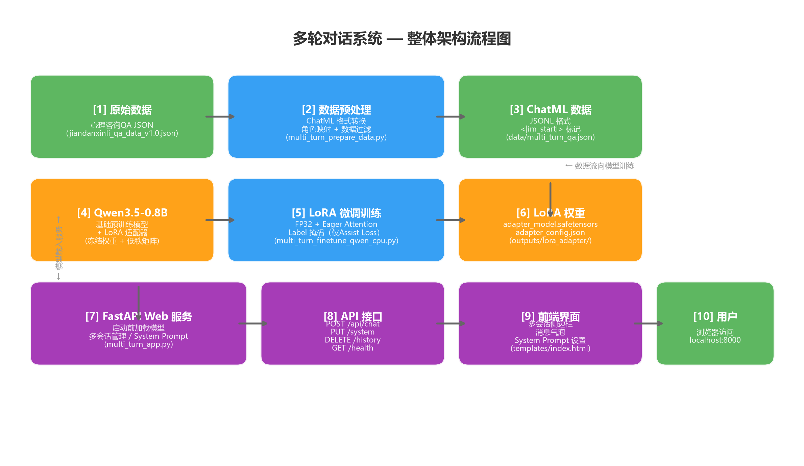
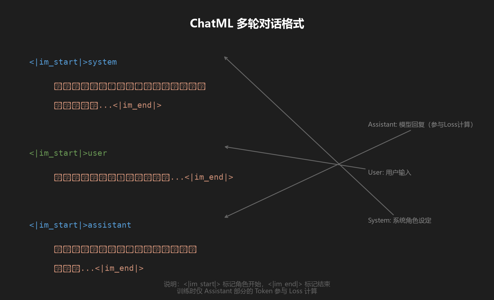
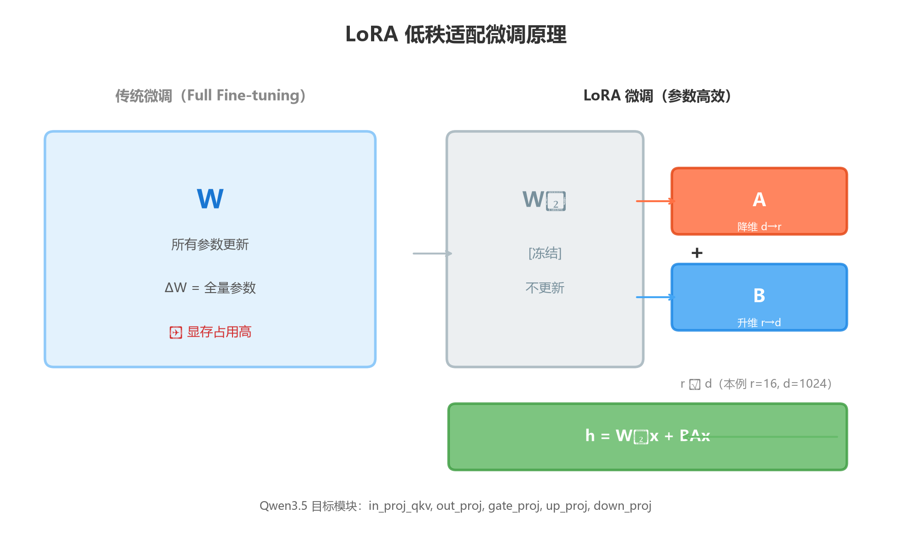
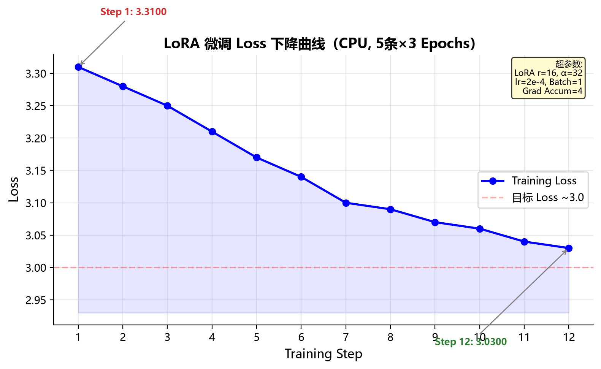
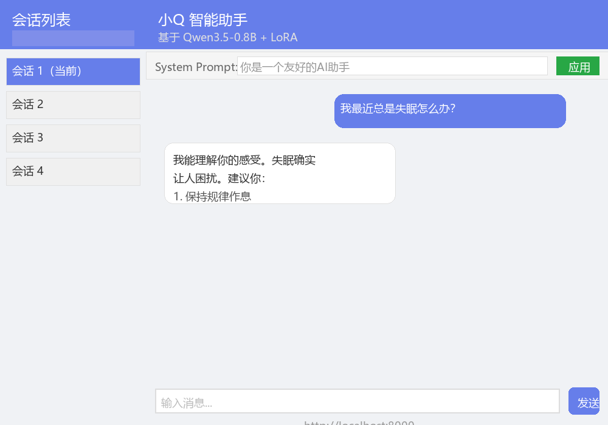

# 多轮对话微调 + 推理服务

> 基于 Qwen3.5-0.8B + LoRA 的多轮对话系统，含数据准备、CPU 微调训练、Web 聊天服务。

---

## 📸 项目一览

| 系统架构 | ChatML 数据格式 |
|:---:|:---:|
|  |  |

| LoRA 微调原理 | Loss 下降曲线 |
|:---:|:---:|
|  |  |

| Web 聊天界面 |
|:---:|
|  |

---

## 🚀 快速开始（5 分钟上手）

```bash
# 1. 克隆仓库
git clone git@github.com:Jared-Linn/generative-qa-class.git
cd generative-qa-class

# 2. 一键部署（自动下载模型 + 安装依赖 + 启动服务）
双击 start.bat
```

**或者手动一步步来：**

```bash
# 1. 安装依赖
pip install torch transformers datasets peft accelerate fastapi uvicorn jinja2

# 2. 下载模型（1.7GB，国内用镜像加速）
set HF_ENDPOINT=https://hf-mirror.com
hf download Qwen/Qwen3.5-0.8B --local-dir Qwen3.5-0.8B

# 3. （可选）用示例数据快速微调，约 3-5 分钟
python multi_turn_finetune_qwen_cpu.py

# 4. 启动聊天服务
python multi_turn_app.py
# → 浏览器打开 http://localhost:8000
```

> 💡 **start.bat 会自动处理以上所有步骤**，首次运行会自动下载模型，之后秒开。

---

## 📁 目录结构

```
generative_qa_class/
├── docs/images/                  # 架构图、原理图等文档图片
│   ├── architecture.png          # 系统架构流程图
│   ├── chatml_format.png         # ChatML 格式示意图
│   ├── lora_diagram.png          # LoRA 微调原理图
│   ├── loss_curve.png            # 训练 Loss 下降曲线
│   └── web_ui.png                # 聊天界面预览
│
├── multi_turn_prepare_data.py    # 数据准备：原始心理咨询数据 → ChatML 格式
├── multi_turn_finetune_qwen_cpu.py  # LoRA 微调训练脚本（CPU 环境）
├── multi_turn_app.py             # FastAPI Web 聊天服务
├── model_loader.py               # 单例模式模型加载器
├── CUDA.py                       # GPU 检测 + PyTorch 安装建议
├── prepare_faq_data.py           # FAQ 数据生成辅助脚本
│
├── data/
│   ├── multi_turn_qa.json        # 训练数据（ChatML 格式）
│   └── class_work/               # 预处理好的样例数据
│
├── templates/
│   └── index.html                # 聊天前端页面
│
├── outputs_multi_turn/           # 训练输出目录（运行时生成）
│   └── lora_adapter/             # LoRA 适配器权重
│
├── Qwen3.5-0.8B/                 # 预训练模型权重（需下载）
├── start.bat                     # 一键部署启动脚本
└── requirements.txt              # Python 依赖
```

---

## 🔄 流程总览

```
心理咨询原始数据                                      用户
     │                                                   │
     ▼                                                   │
  [1] 数据准备 ──► [2] ChatML 格式 ──► [3] LoRA 微调 ───┤
  (multi_turn_prepare_data.py)   (multi_turn_finetune_qwen_cpu.py)
                                                         │
                                                         ▼
                                              [4] Web 聊天服务 ──► 浏览器
                                              (multi_turn_app.py)
```

---

## ⚙️ Step 1: 数据准备

将心理咨询原始 JSON 数据转换为 Qwen ChatML 格式。

### 输入

- `jiandanxinli_qa_data_v1.0.json` — 心理咨询 QA 原始数据

### 运行

```bash
python multi_turn_prepare_data.py
```

### 输出

- `./data/multi_turn_qa.json` — ChatML 格式的训练数据（每行一条 JSON）

### 输出格式示例

每条记录包含 `text` 字段，格式如下：

```
<|im_start|>system
你是一位专业、温暖、富有共情能力的心理咨询师...<|im_end|>
<|im_start|>user
上课走神，学习没劲...<|im_end|>
<|im_start|>assistant
我能理解你的感受...<|im_end|>
```

### 数据映射规则

| 原始字段 | 映射角色 |
|---------|---------|
| `question_title` + `question_content` | 首轮 user 消息 |
| `answer_xxx` 开头的 dialog | assistant（咨询师） |
| `user_xxx` 开头的 dialog | user（提问者追问） |
| — | system（插入固定 System Prompt） |

### 数据过滤

- 跳过无问题文本的记录
- 跳过无回答者的记录
- 跳过无 assistant 回复的对话

---

## ⚙️ Step 2: LoRA 微调训练

在 CPU 上对 Qwen3.5-0.8B 进行多轮对话 LoRA 微调。

### 运行

```bash
python multi_turn_finetune_qwen_cpu.py
```

### 超参数说明

| 参数 | 默认值 | 说明 |
|------|--------|------|
| `LORA_R` | 16 | LoRA 秩 |
| `LORA_ALPHA` | 32 | LoRA 缩放系数 |
| `LORA_DROPOUT` | 0.1 | Dropout 概率 |
| `MAX_SEQ_LENGTH` | 1024 | 最大序列长度 |
| `LEARNING_RATE` | 2e-4 | 学习率 |
| `NUM_EPOCHS` | 3 | 训练轮数 |
| `BATCH_SIZE` | 1 | 批次大小（CPU 内存有限） |
| `GRADIENT_ACCUMULATION_STEPS` | 4 | 梯度累积步数 |

### 训练特点

- **强制 FP32 精度**：避免 CPU 上 bf16/f16 支持问题
- **Eager attention**：避免 Windows 下 attention 实现兼容性问题
- **Label 掩码**：仅 assistant 回复参与 loss 计算，用户输入和 system prompt 被忽略
- **LoRA 目标模块**：`in_proj_qkv`, `out_proj`, `gate_proj`, `up_proj`, `down_proj`
  > Qwen3.5 采用 Gated DeltaNet 线性注意力架构，无标准 q/k/v/o 投影

### 输出

```
./outputs_multi_turn/
└── lora_adapter/
    ├── adapter_config.json
    ├── adapter_model.safetensors
    └── tokenizer.json
```

### 实测结果（CPU 训练，5 条数据 × 3 epochs）

```
Step    1 | Loss: 3.3117
Step    5 | Loss: 3.0944
train_loss: 3.0254
训练耗时: 209s（约 3.5 分钟）
```


> ⚠️ **注意**：5 条训练数据仅供跑通流程，实际微调建议准备 **数百到上千条** 数据。

---

## ⚙️ Step 3: 启动 Web 聊天服务

基于 FastAPI 的多轮对话 Web 应用，支持多会话管理、System Prompt 自定义。

### 启动

```bash
python multi_turn_app.py
```

### 访问

- **聊天界面**：http://localhost:8000
- **API 文档**：http://localhost:8000/docs

### 功能

| 功能 | 说明 |
|------|------|
| 多轮对话 | 自动记忆上下文，同一 session_id 共享历史 |
| 多会话管理 | 左侧会话列表，新建/切换/删除会话 |
| System Prompt | 每会话独立设置 AI 角色和行为 |
| 历史记录 | 保留最近 20 条消息（10 轮对话） |

### API 接口

| 方法 | 路径 | 说明 |
|------|------|------|
| GET | `/` | 聊天首页 |
| POST | `/api/chat` | 聊天请求 |
| PUT | `/api/session/{id}/system` | 更新系统角色 |
| GET | `/api/session/{id}` | 获取会话信息 |
| DELETE | `/api/history/{id}` | 清空历史 |
| DELETE | `/api/session/{id}` | 删除会话 |
| GET | `/api/health` | 健康检查 |
| GET | `/api/sessions` | 所有活跃会话 |

### 聊天 API 调用示例

```bash
curl -X POST http://localhost:8000/api/chat \
  -H "Content-Type: application/json" \
  -d '{
    "session_id": "user_001",
    "question": "我最近总是失眠",
    "system_prompt": "你是一个温柔的心理咨询师"
  }'
```

响应：

```json
{
  "answer": "听起来你最近睡眠不太好...",
  "session_id": "user_001"
}
```

### 配置参数

在 `multi_turn_app.py` 顶部可修改：

| 参数 | 默认值 | 说明 |
|------|--------|------|
| `MAX_NEW_TOKENS` | 256 | 最大生成长度 |
| `TEMPERATURE` | 0.7 | 温度系数 |
| `TOP_P` | 0.9 | 核采样阈值 |
| `REPETITION_PENALTY` | 1.1 | 重复惩罚 |

---

## 🛠 辅助工具

### CUDA.py — GPU 检测与 PyTorch 安装建议

```bash
python CUDA.py
```

检测当前机器的 GPU 型号、显存大小、CUDA 版本，并生成对应的 PyTorch 安装命令。

支持检测：
- ✅ NVIDIA GPU（通过 nvidia-smi）
- ✅ AMD GPU（通过 PowerShell）
- ✅ Intel GPU（通过 PowerShell）

### model_loader.py — 单例模型加载器

```python
from model_loader import model_loader

model, tokenizer = model_loader.load_model("path/to/Qwen3.5-0.8B")
```

特点：
- **单例模式**：确保整个应用只加载一次模型
- **延迟加载**：首次调用时加载，之后复用
- **线程安全**：适合 FastAPI/Uvicorn 多 worker 环境

---

## 📄 文件职责一览

| 文件 | 职责 | 输入 | 输出 |
|------|------|------|------|
| `multi_turn_prepare_data.py` | 原始数据 → ChatML | `jiandanxinli_qa_data_v1.0.json` | `data/multi_turn_qa.json` |
| `multi_turn_finetune_qwen_cpu.py` | LoRA 微调训练 | 基础模型 + ChatML 数据 | `outputs_multi_turn/lora_adapter/` |
| `multi_turn_app.py` | FastAPI Web 服务 | 基础模型 + LoRA 适配器 | HTTP 聊天接口 |
| `model_loader.py` | 单例模型管理 | 模型路径 | `model`, `tokenizer` 实例 |
| `CUDA.py` | GPU 检测工具 | 无 | GPU 信息 + 安装建议 |
| `prepare_faq_data.py` | FAQ → ChatML 数据 | `faq_expanded.json` | `data/multi_turn_qa.json` |
| `templates/index.html` | 聊天前端 UI | 无 | HTML 聊天页面 |

---

## ⚠️ 注意事项

### 1. 数据格式

训练数据要求 **JSONL 格式**（每行一个完整 JSON 对象），`text` 字段包含 ChatML 格式的多轮对话：

```json
{"text": "<|im_start|>system\\n...<|im_end|>\\n<|im_start|>user\\n...<|im_end|>\\n..."}
```

JSON 对象不能跨多行（pretty-print 格式会导致 `load_dataset("json")` 解析失败）。

### 2. Qwen3.5 架构差异

Qwen3.5 使用 **Gated DeltaNet 线性注意力**，与传统 Transformer 不同：

| 传统架构 | Qwen3.5 |
|---------|---------|
| `q_proj`, `k_proj`, `v_proj`, `o_proj` | `in_proj_qkv`, `out_proj` |
| 标准 MLP | `gate_proj`, `up_proj`, `down_proj` |

LoRA 的 `target_modules` 需相应调整（已在本项目中修正）。

### 3. transformers 版本兼容性

本项目在 **transformers 5.11.0** 下测试通过。已知变化：

- `data_loader_num_workers` → `dataloader_num_workers`
- `torch_dtype` → `dtype`（仍兼容旧写法）
- `model.to("float")` → `model.float()`

### 4. Windows 编码问题

Windows 终端默认 GBK 编码，脚本中的 emoji 字符可能报错。
运行时加 `-X utf8` 参数解决：

```bash
python -X utf8 multi_turn_finetune_qwen_cpu.py
python -X utf8 multi_turn_app.py
```

### 5. 训练数据量

当前 `data/multi_turn_qa.json` 仅包含 **5 条心理咨询多轮对话**（每条约 5 轮对话）。
仅供跑通流程验证，实际微调建议准备 **数百到上千条** 数据。

原始数据准备脚本 `multi_turn_prepare_data.py` 需要输入文件 `jiandanxinli_qa_data_v1.0.json`，该文件未包含在本仓库中。

### 6. Web 服务 Worker 数

`multi_turn_app.py` 采用**启动前加载模型**策略：
1. 在 FastAPI 启动前先加载模型
2. 模型加载失败则整个服务不启动
3. 确保服务启动后请求不会因模型加载而超时

**Worker 数必须为 1：**
```python
uvicorn.run("multi_turn_app:app", workers=1)  # 模型只有一份实例
```

---

## 📦 环境要求

### 硬件

| 阶段 | 推荐配置 |
|------|---------|
| 数据准备 | 任意机器 |
| 微调训练 | CPU 16GB+ 内存（训练时约占用 8-12GB） |
| Web 推理 | CPU 8GB+ 内存（模型加载后约占用 4-6GB） |

### 软件依赖

```bash
pip install torch transformers datasets peft accelerate
pip install fastapi uvicorn jinja2
```

本项目已测试的依赖版本：

| 包 | 版本 |
|---|------|
| Python | 3.10+ |
| torch | 2.12.0 |
| transformers | 5.11.0 |
| datasets | 5.0.0 |
| peft | 0.19.1 |
| accelerate | 1.13.0 |
| fastapi | 0.136.3 |
| uvicorn | 0.49.0 |
